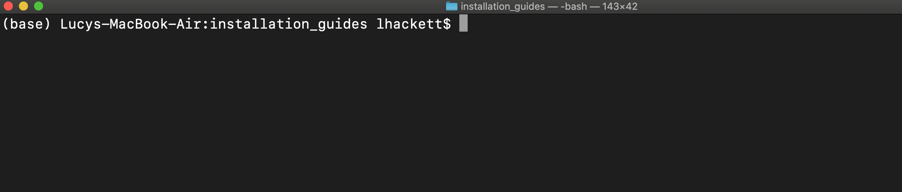

```{r setup, include=FALSE}

knitr::opts_chunk$set(echo = TRUE)
```

# What is Anaconda?

Anaconda is a **package manager**. For all your favorite programming languages, you use packages. Probably, lots of packages. The issue is that packages are complicated- they change over time via different versions, they may not play well together, and we all know the frustration of trying to use someone else's code and having errors pop up because we don't have the right dependencies installed.

Enter: Anaconda. 

Anaconda is a systematic way of installing packages, making sure they don't conflict with each other, and creating separate _environments_ that allow you to work with different packages/versions with different projects. To give you an example, I work (for now) with python 3.7 on my computer, but for a class I needed to use a package that required python 3.5 or lower. Anaconda allows me to make a new environment where I could have python 3.5 and the necessary package installed, without messing up my python 3.7 installation that everything else depended on! Even beyond environments, Anaconda just simplifies the installation of many packages. Some packages have complicated dependencies that require tricky installation; Anaconda usually takes care of all that for you. 

If you are reading this tutorial as a means of installing python, conda will also install python and give you a way to manage python versions as well as packages.

# Installation

Anaconda comes in 2 versions: Anaconda, and miniconda. Anaconda is a beast- it includes the package manager, an application that helps you manage the packages in a nice frame, and also comes with a whole slew of packages installed for you directly. This can be nice, as you avoid installing lots of packages later. However, I tend to recommend miniconda, which includes just the package manager, python and a few other basic packages. Why? The main reason is space. Not all laptops have enough memory for all those packages, many of which you many never use. The rest of this guide will focus on installing and using miniconda, but the instructions and ideas are very similar for full Anaconda.

You can find the installation links [here](https://docs.conda.io/en/latest/miniconda.html); just find your OS, and follow the installation instructions (note: for mac, download the pkg installer)!

# Using Anaconda

Now what? Let's create an environment for doing metrics in python. I'm going to walk you through creating an environment, activating it, and installing packages. First, we need to open up a command line. On Macs this command line is called Terminal (look for it in Applications) and uses the bash scripting language.^[Also Linux, but I won't treat Linux separately here. If you are using Linux I'm going to assume you have the coding skills to do most of this yourself.] On PC's, you need to open the PowerShell, which allows you to run bash script. 



## Creating, activating conda environments

Above is a screenshot of my terminal. If you've used terminal before, you'll note that something has now changed - there this ``(base)`` thing in front of my directory. This is our current environment! I generally try to leave the base environment alone, so let's create a new environment by typing (in the terminal): 

```
conda create --name env-name
```

where ``env-name`` is the new name of your environment. For example, maybe I want to create an environment specifically for my coursework in ARE212, so I create an environment like this:

```
conda create --name are212
```

When the terminal prompts you if you want to proceed, input "y". To "activate" this environment we just type:

```
conda activate are212
```

And you should see that ``(base)`` has changed to ``(env-name)``. We are now "in" the env-name environment, and we _only have access to the packages installed in env-name_, which at the moment is none! So let's install. 


## Installing packages in conda environments

I am going to set up a simple environment that just has python 3.7, jupyter notebook, spyder, statsmodels, pandas and numpy for some basic metrics. Remember you can always install more packages later, though trying to install the bulk of your packages at the beginning can sometimes help avoid conflicts later. 

Our first step is actually going to be to make sure the conda-forge channel is added to conda. We're not going to worry too much about channels, just type:

```
conda config --add channels conda-forge
```


**Making sure that our new environment is activated**, we will run ``conda install``. With this, we can choose to specify the version we want, or if we do not specify then the most recent version will attempt to be installed. So below I will specify the python version but let all the other packages be the most recent. I won't get into conda channels here, but note that googling "conda install PACKAGE-NAME" will usually turn up code you can copy paste into your terminal to install packages. We will also ask conda to use the channel we added, conda-forge You can install packages one at a time, or several at once:

```
conda install python=3.7 notebook spyder statsmodels pandas numpy -c conda-forge
```

Voilá! Now our environment is set up with these packages. If you want to test this, try:

```
conda list
```

This should return a list of the installed packages. If you create a new environment and run this same command, you will notice that you get an empty list because there are no programs available!

To deactivate a conda environment, just type:

```
conda deactivate
```

Now you have conda, python and other packages installed! 

# IDEs or actually running python

The rest of this tutorial will assume that you have initialized an environment called ``env-name`` with the above mentioned packages. Mine will be called ``are212``, but feel free to continue with any environment name. First, make sure this environment is activated. 

Though this is not how you will normally use python, I want to point out that in our new environment we can now run python directly in our terminal. To see this, open your terminal and activate your new environment. Then type:

```
python3
```

You'll notice that your terminal changes again: you'll see a ``>>>`` symbol, indicating that anything typed on these lines is no longer bash script, but python code. Test it out by typing some python code:

```
print("hello world!")
2+2
```

To exit the python editor, type:

```
exit()
```

Directly typing python code into an editor that immediately deletes all your code after ``exit()`` is clearly not an ideal way to write code. Another option is to write python code in a plain text file, save it as myscript.py, then run it from the terminal using ``python3 myscript.py``. But this is also a bit clunky- we'd like to use an editor that lets us directly interact with our code. This kind of editor is called an IDE- an Integrated Development Environment. Essentially, it is (at a minimum) a software application that combines scripting, the command line, and debugging tools into one integrated space. For example, RStudio is an IDE for R, because it has a script editor, a command line, and some support for debugging. 

So, what's the "RStudio" of python? Well, there are several, and each is good for different kinds of tasks. I will briefly introduce you to two of the most accessible IDEs for beginners-- spyder and jupyter notebooks-- but there are many and if you ask python users I'm sure they'd be happy to tell you about the IDE they love and why. You have already installed both of the IDEs in your new conda environment, so let's take a look!

## Jupyter notebooks

Jupyter notebooks are a lovely IDE that is especially nice for checking out data, creating didactic materials, or turning in problem sets. I start with this IDE because it is what we will be using as our primary tool for ARE212. To use a jupyter notebook, first make sure your environment that has notebook installed is activated. Then type in the terminal:

```
jupyter notebook
```

And a notebook browser window should pop up in your browser. If you pay close attention, you'll notice that the folders you see are only the folders below your working directory from terminal. Your working directory is your "location" in the terminal, and can be observed in the space before the ``$`` on your terminal lines. For example, in the images above, the fact that "are-comp-resources" appears before the ``$`` means that that is the subfolder I am located in. If you did not change anything when opening your terminal, you may see a ``~`` before the dollar sign; that is because ``~`` is shorthand for your home directory. In the terminal (not when jupyter notebook is running) you can change directory with the ``cd`` command, using ``cd /subfoldername/next_subfoldername`` to move around, and ``cd ..`` to move "up" a level in your "tree" of folders. This aside is important for jupyter notebooks because if you have used ``cd`` to move to a subfolder in your directory, and then you run ``jupyer notebook`` you will only be able to access/save jupyter notebooks in that subfolder or its subfolders, but not in folders "above" it in the tree. 

Let's make a new jupyter notebook. You can do this by navigating to the place you want to save the notebook to, then going to the upper right hand corner and clicking New > python 3. You can also open existing notebooks by navigating to the file in the folders and then clicking on the ipynb (the jupyter notebook termination) file to open. You can learn more about using a jupyter notebook by clicking on the links in [this tutorital](https://hub.gke2.mybinder.org/user/ipython-ipython-in-depth-ue5exl6r/notebooks/binder/Index.ipynb).

In order to close the jupyter "server" in termal, click on your terminal and hold ``Ctrl+C``. When it asks if you want to shutdown the notebook server, input ``y`` to confirm. Any notebook running will have their kernel "die" when you do this, so close the notebook by exiting the tab on your browser.  


## Spyder

Spyder is an IDE developed for data scientists, and it will remind you a LOT of RStudio. To open and use spyder, just open your terminal, activate the environment where you installed it, and type:

```
spyder
```

After a couple of seconds, a spyder window will open. It has a place for writing scripts (.py files), a console to run one-off code, and a panel where you can see the variables you have defined or toggel to see any plots generated! This is currently my IDE of choice since it is very easy to use for data work, and there are lots of features to explore here. A few basics:

* Run highlighted code with the I> button above.
* Run a code chunk (starts and ends with ``#%%``) with the box with a single arrow. To run a chunk and advance to the next, click the box with the double arrow.
* Run the whole script with the green arrow.
* You can see your working directory in the upper right hand corner; change with the folder icon. 
* Click on variables in the Variable Explorer to inspect them. 

To stop spyder, just close the window. 


