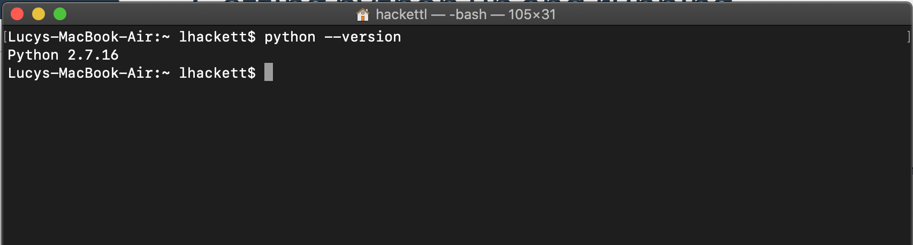
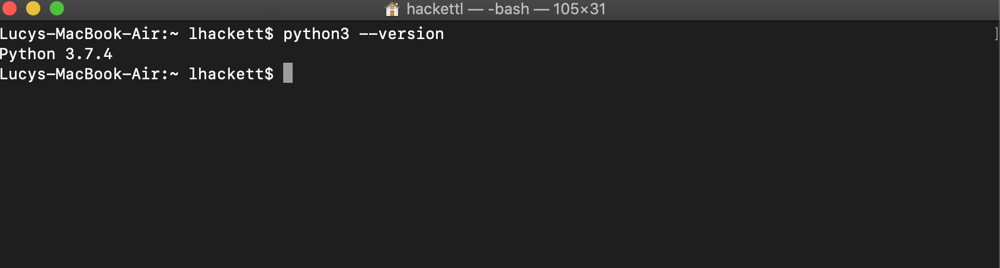
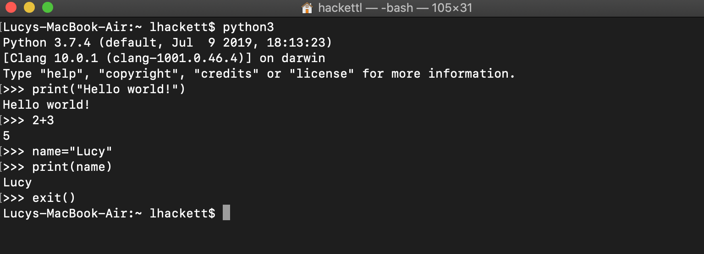
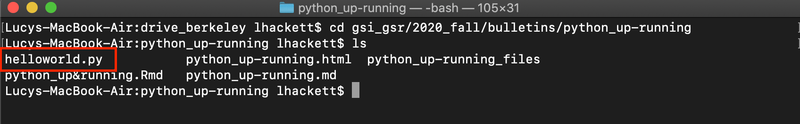

## Installation

We're going to start with an exercise to see if you have python on your machine already, and what version it is. Before you have an IDE^[Integrated development environment] or have even opened Notepad++ (or a text editor of your choice) you can interact with python directly on your computer's command line. On Macs this command line is called Terminal (look for it in Applications) and uses the bash scripting language.^[Also Linux, but I won't treat Linux separately here. If you are using Linux I'm going to assume you have the coding skills to do most of this yourself.] On PC's, this is called Command Prompt (search for it in the search bar). 

To check your version of python (and consequently, if you have it), open the command line and type ``python --version``. If you do not have python, your command line will reappear after having reported nothing; that's because it couldn't find python, and so it did nothing. If you have python 2, then the version should appear, as in the image below:

<par></par>

If you have a mac computer, you should get a result for the version of python because all Mac's come with python 2 installed!^[It is needed by the operating system as a dependency for some preinstalled software.]

### A word on versions

As do all software, python evolves over time and has different versions. While most of the time the differences between these versions are not even perceptible to us given the types of coding we tend to do as economists, there is a real and large difference between the family of versions of python 2 and python 3.^[These differences are noticeable because they affect some common syntax, for example around printing, and famously are not backwards compatible. Fun fact, I am new enough to all this that I have never programmed in python 2!] Therefore, we want to make sure that we are **always running python 3**, regardless of whether you also have python 2 installed as well.^[Both can be installed simultaneously without a problem.] 

### Finally, let's install python 3

The most recent version of python 3 can be found [here](https://www.python.org/downloads/). To install:

1. Download the suggested file, making sure that it is some version of python 3
2. Open the executable file and follow installation instructions.
    **Very important for PC users:** 
    - When you open the .exe file, you ABSOLUTELY MUST click the box that says "Add Python 3.8 to PATH".
    - I recommend doing custom installation; when you get to the "Advanced options" page, leave all selected boxes as they are, but also select the option "Add python to environment variables"

Once the installation is complete, we can check that it was installed correctly by checking the version in the command line as we did above (you may want to close your command window if it's still open and open a new one). For PC users, you can type ``python --version`` as above, and now you should see the version printed! For mac users, when using python 3, we are always going to use the ``python3``command.^[This allows python 2 and python 3 to play nicely together on the same system; we always tell the computer exactly what version we want to use.] So open your command line, and type ``python3 --version``. For the rest of this tutorial, I will be using python3, but PC users should replace all instances of this with just ``python``. 

<par></par>

### pip

``pip`` is another program that was installed together with python. It is actually itself an installer for python, and will help us install different packages (think install.packages() if you are familiar with R, or ssc install for Stata). Let's make sure pip was also installed correctly; PC's, type in the command line ``pip --version``. Mac users, again, we want to distinguish version 3 pip from version 2 pip, so we will type ``pip3 --version``.

<par></par>

Success!

## My first python script

### Command line python

Unlike Stata which is always run from within an application with buttons and script, python can be run directly from your computer's command line. Let's try it. In order to tell python to start running python in the command line:

1. Open the command line
2. Type ``python3``

You should see maybe some text, but at the bottom instead of the information you usually see at the beginning of a command line prompt, you will see ``>>>``:

<par></par>

Now we can see that ``python3`` is actually a command that tells the computer, "I want to write python code". Above when we added ``--version``, we added an *option* that specified that we wanted to know about the version of python, not run code. Now in these lines marked with ``>>>``, we can write commands recognized by python. Let's start with the most cliche: experiment with the following:

``print("Hello world!")`` 

``2+3``

``name="Lucy"``

``print(name)``

``exit()``

<par></par>

Note that after typing ``exit()``, the arrows went away and we are back to the normal, non-python command line. 

### Python scripts

I wanted to show you the above so that you have a first intro into the command line if you haven't seen it before, and so that you understand the relationship between a command line (or console, in R) and an *IDE*. IDE's like R Studio, Spyder, or Atom may appear to run "in applications", that's what makes them attractive and friendly, but really they are running commands like the ones we tried out above. 

However, working directly on the command line has clear drawbacks. First, once we exit, our work is lost and we have no way to reproduce in a systematic way our work. In order to save our work so that we can edit it later or share it with others, we need to write *scripts*. 

A python script can be written in any text editor. On PC's Notepad++ is a pre-installed text editor you can use. On Mac's there are none that I am really happy with; for a simple but great text editor consider installing [Sublime text 3](https://www.sublimetext.com/3). For our first python script, follow these steps:

1. Open a new file in Notepad or in Sublime
2. Type ``print("Hello world!")``
3. Save as **helloworld.py**, making sure you specify the extension as .py!

<par></par>

Now to run this script, we need to do 2 things: tell our computer where it is, and tell it to run it. 

#### Step 1: Navigating in your computer

A **directory** in your computer is essentially a location where files are saved. In order to run our script, we need to go to the directory where it is saved. In the command line, we can change directories using the command ``cd``. First, let's see where we are. In the command line, you'll notice there is text in front of where you type, in front of a dollar sign ``$``. That text is your current location in the computer! For example, in front of the dollar sign in my terminal, it says ``~ lhackett``. This is my home directory (the home directory is denoted with ``~``). 

To see what directories are immediately "below" us as files or in sub folders, type ``ls`` in the command line:

<par></par>

As we can see, I have several folders contained in my home directory. To go to one of these, I can just specify its path relative to where I currently am with ``cd``:

``cd drive_berkeley``

I can see this change was successful because the text before my command prompt changed to the desired folder, and when I type ``ls``again, now I see the folders that are contained in the folder ``drive_berkeley``.^[To move "up" directories, use ``..`` For example, to move up two levels from where you are, you would type
``cd ../..``]

<par></par>

I don't have to go step-by-step either; I can specify the full path to the file I want to run:

``cd GSI_GSR/2020_fall/bulletins/python_up-running``

Checking I'm in the right place, I run ``ls`` to make sure I see my python script:

<par></par>

Now that we're in the right location, let's run our script.

#### Step 2: Running the script

This is the easy part. Just type in the command line:

``python3 helloworld.py``

If everything has been done correctly, you should see ``hello world!`` printed in the command line, just like it did when we were in the interactive python script. 
Using the command line is an important skill,^[If you want to learn more about programming in bash (Unix), check out this awesome intro: [The Unix Workbench](https://seankross.com/the-unix-workbench/introduction.html)] and I still frequently combine work on the command line with work in IDE's, which I will discuss in the next section.

## IDEs

An IDE is an Integrated Development Environment. Essentially, it is (at a minimum) a software application that combines scripting, the command line, and debugging tools into one integrated space. For example, the text editors we used above are not IDE's, because while we can write code (script), we need to open a separate application (the command line) to run the code. In an IDE, all this is done in one place. An example of an IDE you may already use and love is R Studio. In R Studio, you can write and save R scripts, run R code, and use additional tools for package installation, figure visualization, data and variable visualization, and more. 

There are many, many IDE's out there for python, and each has its own features and tools that may be useful for different tasks. I'll just introduce you to a few here and show you how you can set them up, though usually this process is very easy (IDE's are supposed to make your life easier, not harder). These are in no particular order. 

### Spyder

Spyder is a great IDE made specifically for doing data science in python! It has a variable explorer (similar to R Studio) and a plot frame so you can store/see output, as well as a python console built in. Syder is beautiful, but it is not recommended that you install Spyder on its own; instead, use it with Anaconda.^[Anaconda is a package management system that I won't get into here, but it is helpful for the installation and management of python packages.] The good news is if you install Anaconda, Spyder comes with it, and you really don't have to do anything extra to get started! Just open the Anaconda navigator, choose Spyder, and start writing your python script. 

### Jupyter notebook

Jupyter notebooks are great for exploratory data work, when you want to look at data frames, see plots, and inspect things on the fly because it is structured around a type of piece-by-piece logic where the notebook is separated into cells that you run one at a time (or all at once). **JupyterLab** is newer but also great for working with data, with separate windows for graphs that R Studio lovers will <3. 

If you have Anaconda, Jupyter also comes with it! So just skip to the part that says "To see if the notebook installation worked...". 

Jupyter is easy to install using the ``pip3`` command I talked about earlier. Just open up your command line and type either 
``pip3 install notebook``, or
``pip3 install jupyterlab``

To see if the notebook installation worked, type ``jupyter notebook`` into the command line. A tab in your browser should open with the sub folders of the directory you were in in your command line. This is an important lesson for using jupyter notebooks: the notebook opens wherever you are in the command line. From there you can navigate to sub folders, but you can't navigate to folders that are above you! So make sure you ``cd`` to the right place before opening a notebook. For your first jupyter notebook, from the browser menu choose "NEW" in the upper right hand corner, and choose "Python 3" under Notebook (note you can also install an R kernel for Jupyter notebook, letting you run R notebooks too!). Write a bit of code in the first box, then press ``CTRL+ENTER`` to run. 

Add new lines with the **+** button, and change the name of the notebook by pressing where it says "Untitled" above. When you're done editing, save the file, return to your command line, and press ``CTRL+C``. The command line will ask you if you're sure you want to end the session, enter ``y`` to confirm.

To start a JupyterLab, open your command line, navigate to where you want to be with ``cd``, and enter the command ``jupyter lab``. From here things work pretty similarly as in the notebook, so I won't go through it again. 
  

### PyCharm

PyCharm (available [here](https://www.jetbrains.com/pycharm/)) has several nice features like integration for git and support for other languages (particularly web development languages). It also manages virtual environments really nicely. The biggest downside to PyCharm is that its "scientific mode", which offers windows for plot visualization and variable management (like R Studio) is only available with the professional (not open source) version. To make your first project in PyCharm:

1. Download and install PyCharm from the link above (the open source version)
2. Open PyCharm and create a new project
  1. Choose a location for the project
  2. Choose "New environment using..." and choose one of the options. If you are new to virtual environments, choose "virtual env" and below that select "Inherit global site-packages". This will make all packages installed on your computer available to the project. Make sure the base interpreter is python 3.something. 
3. Create. 
4. To create a new file in this project, right-click on the file icon with the project name, and choose New File. Name it something with a .py extension, like "tester.py"
5. Enter some code in the script to get it started, for example, ``print("Testing")`` and save.
6. To run, right-lick on some blank space in the script, and choose "Run 'file_name'". You should see a type of command line pop up, with the outcome of your script! Also note that in the upper right-hand corner, a box appeared with your file name and a green arrow. You can now use this green arrow to run your code! 

### A final quick note

As I mentioned above, all IDE's come with their own python console where you can run code as you work on it right there in the editor. But once you save a script, as long as it has the ``.py`` extension, you can always run it from the command line without opening it in an IDE just like we did with our first helloworld.py script. Note that Jupyter notebook scripts have the ``.ipynb`` extension, so these are not run in the command line (though you can convert any Jupyter notebook to a normal python script, at which point you would be able to run it in the command line). 

## Conclusion

I hope this intro has been useful for getting on your feet in python! 

Happy coding,

Lucy
